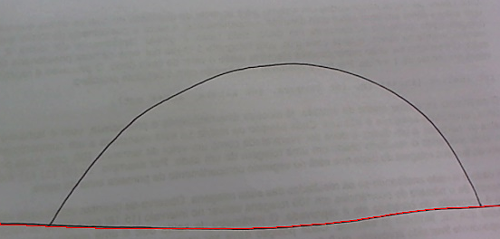
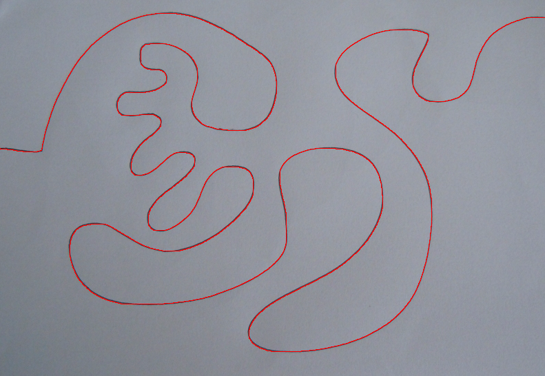
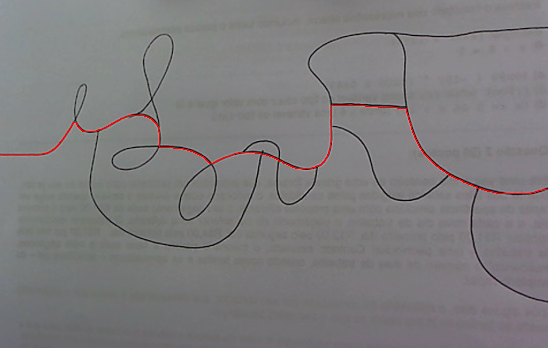
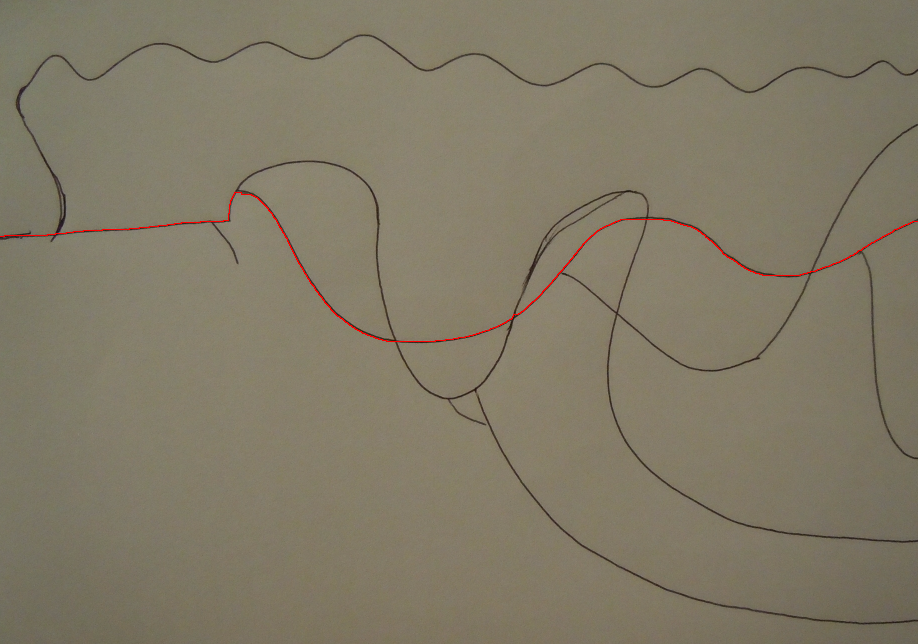
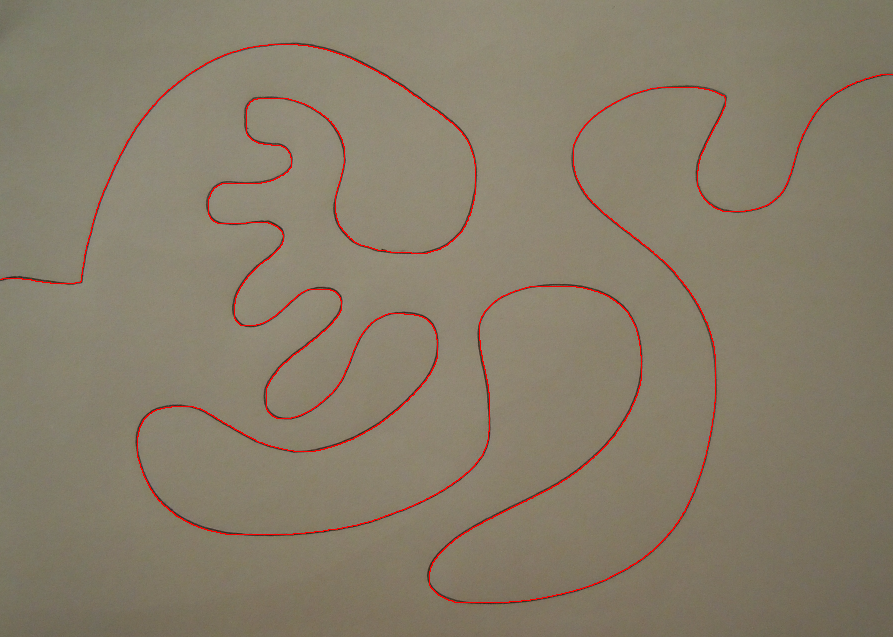
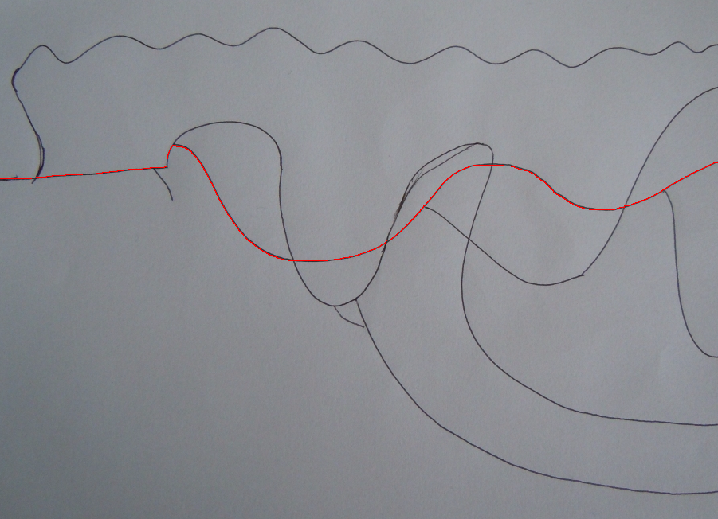
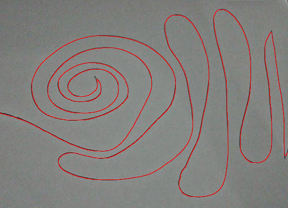
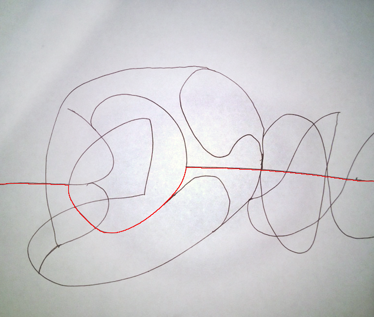
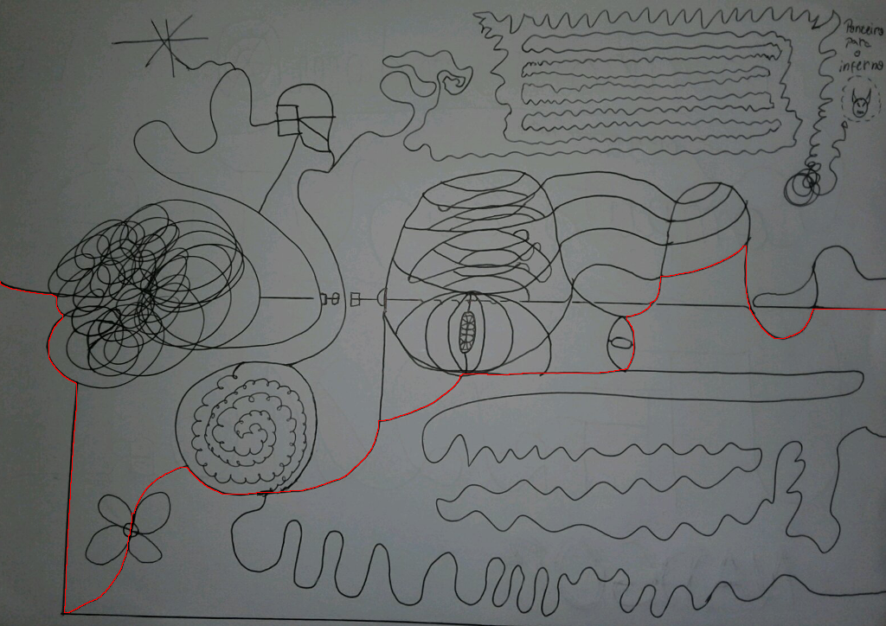

# Encontrando Caminho em Labirinto
O [problema](Problema.pdf) que foi colocado.

A [solução](Solução.pdf) explicando como chegamos nela.

## Descrição

Este projeto tem como objetivo encontrar a saída de um labirinto desenhado em papel e fotografado. O labirinto é representado por uma imagem em escala de cinza, e o desafio é encontrar o caminho mais curto entre a entrada (lado esquerdo) e a saída (lado direito) da imagem. O projeto explora conceitos de processamento digital de imagens e algoritmos de busca de caminho mínimo.

## Objetivo

Desenvolver uma função que determine o caminho mais curto de uma entrada (lado esquerdo da imagem) para uma saída (lado direito da imagem) em um labirinto fotografado. A função deve lidar com imperfeições da imagem, como sombras e variações de iluminação.

## Funcionalidade

- **Entrada:** Imagem em escala de cinza representando o labirinto. A entrada está localizada na borda esquerda (x=0) e a saída está na borda direita (x=largura-1).
- **Saída:** Número de passos do caminho mais curto e um vetor de coordenadas representando o caminho.

## Estrutura do Código

- **`geraMatriz`**: Cria e inicializa uma matriz auxiliar preenchida com valores representando paredes e caminhos.
- **`matrizDeCusto`**: Calcula a matriz de custos para encontrar o caminho mais curto e determina o menor custo para a saída.
- **`calculaPontos`**: Preenche um vetor de coordenadas com o caminho mais curto a partir da matriz de custos.
- **`encontraCaminho`**: Função principal que processa a imagem, cria a matriz auxiliar, calcula o caminho mínimo e aloca o vetor de coordenadas com o caminho encontrado.

## Funções Principais

### `geraMatriz`

Esta função cria e inicializa uma matriz auxiliar usada para representar o labirinto. A matriz é preenchida com valores indicando paredes e caminhos:
- **Parâmetros:**
  - `altura`: Altura da imagem.
  - `largura`: Largura da imagem.
- **Retorno:** Matrizes alocada e preenchida com valores padrão representando paredes.

### `matrizDeCusto`

Calcula a matriz de custos para encontrar o caminho mais curto através do labirinto. O algoritmo verifica todos os caminhos possíveis e atribui valores de custo baseados na distância do ponto de entrada até a saída.
- **Parâmetros:**
  - `matriz_custo`: Matrizes auxiliar com valores de caminho.
  - `altura`: Altura da matriz.
  - `largura`: Largura da matriz.
- **Retorno:** O menor número de passos para chegar à saída.

### `calculaPontos`

Preenche um vetor de coordenadas com o caminho mais curto encontrado a partir da matriz de custos. O algoritmo percorre a matriz de custos a partir da saída para a entrada, reconstruindo o caminho.
- **Parâmetros:**
  - `matriz`: Matrizes auxiliar com valores de caminho.
  - `altura`: Altura da matriz.
  - `largura`: Largura da matriz.
  - `numero`: Menor caminho possível.
  - `pontos_vermelhos`: Vetor que armazenará as coordenadas do caminho.

### `encontraCaminho`

Função principal que processa a imagem do labirinto, cria e inicializa a matriz auxiliar, calcula o menor caminho e aloca o vetor de coordenadas com o caminho encontrado. A função:
1. Processa a imagem para identificar os caminhos e paredes.
2. Preenche a matriz auxiliar com valores representando o caminho.
3. Calcula a matriz de custo e encontra o caminho mais curto.
4. Aloca e preenche o vetor de coordenadas com o caminho encontrado.
- **Parâmetros:**
  - `img`: Imagem em escala de cinza do labirinto.
  - `caminho`: Ponteiro para o vetor onde o caminho será armazenado.
- **Retorno:** Número de passos do caminho mais curto, incluindo o ponto de entrada e a saída.

### Resultado praticos:

           
